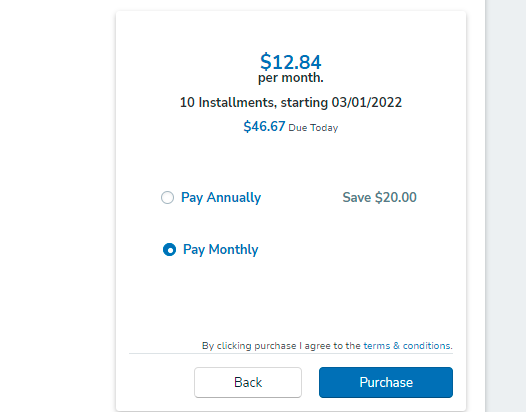

# Heading 1 
## Heading 2
### Heading 3
#### Heading 4
##### Heading 5
###### Heading 6
###### No more than 6 headings. Also, 1st heading is underlined

This normal text

> This is special text. For special text, you need to put a greater than symbol at the start
>
> For a line break, you need to enter two times. Also if you want to include the line break in special text, then put a greater than symbol in the blank line as well.

**Bold**  for bold text, you need to put double * before and after text

*Italic* for italic text we need to put single * before and  after text

***Bold and Italic*** for both bold and italic text, you need to put 3 * before and after the text

__Bold__ we can also use double underscore on both side of the text for making it bold

_Italic_ single underscore on both sides can be used for italian text

- Bullets:  for bullet point, we put a dash at the start of the line, but make sure to add a space after the dash

    - Sub-Bullet: for sub bulleting, pressa tab button and then add a dash at the start
        - Sub-sub listing


- Here we go again to normal

> Numbering of lists: for numbering, put number with a dot as shown below;

1. Number 1

    1. Number 1 sub numbering

    2. And so on...

2. Number 2 

3. So on...


> We can also use * and + for bullet points

* Number 1

+ Number 2

# Line breaks and page breks
This is page 1: We can add 3 dashes, *, or underscores after any text where we wan breaks

---

This is page 2

___


This is page 3

***

This page 4


# Links and hyperlinks

to add any link just put it in the less than and greater than symbols like

<https://www.youtube.com/watch?v=qJqAXjz-Rh4&list=PL9XvIvvVL50HVsu-Ao8NBr0UJSO8O6lBI&index=22&ab_channel=Codanics>

SImilarly sometimes the text is hyperlinked so for that , put your text in square brackets and then add parenthesis direct after the brackets where you will add the actual link

[This is the link to the website](https://www.youtube.com/watch?v=qJqAXjz-Rh4&list=PL9XvIvvVL50HVsu-Ao8NBr0UJSO8O6lBI&index=22&ab_channel=Codanics)

The link is not actually shown but the text is linked

For a key to a link like 'Click here', we use the following way

[Any text you want]: https://www.youtube.com/watch?v=qJqAXjz-Rh4&list=PL9XvIvvVL50HVsu-Ao8NBr0UJSO8O6lBI&index=22&ab_channel=Codanics

The course videos are [here][Any text you want]

We can see above that the 'here' is now hyperlinked

# Images and figures with link

We can upload the pic in following way, but it should be in the same folder of this coding file. My file name is rental.png so lets see

[rental](rental.PNG)
 

 so we can seen by clicking the link. if you want it to be displayed, then just put a ! before its code like below and vice versa. We can do the same for pdf file etc as well.

 

> Assignment: How to comment out a markdown line and its shortcut?

Shortcut is shift+Alt+A

lets test it<!-- lets test it -->

If we want an online picture then just copy its link and do the same as with other links so;

[Codanics](https://www.google.com/search?q=codanics&sxsrf=APq-WBsdcpBy_InSSin_RLI3IF417ODsJw:1647551563623&source=lnms&tbm=isch&sa=X&ved=2ahUKEwjkncvth872AhWdknIEHZrVAiIQ_AUoAXoECAEQAw&biw=1600&bih=700&dpr=1#imgrc=jSNIAJI341a1QM)

we can see the hyperlinked codanics. If you put ! before it, it will be shown


# Adding code or block code

For having code in the text use comma type symbol, which is on key before button 1 on keyboard `print("here we can add the code in the text as you can see")`

To add a block of code, add 3 ``` before and after and you will see as below;

```python
x=3+2
y=2-1
z=x+y
print(z)

```
> we can save file for each type of langauge just by writing the name of that language at the start like above, I wrote python. lets say we use the same code for R language then we can observe the changes in the color and syntax accordingly

```r
x=3+2
y=2-1
z=x+y
print(z)

```

# Adding tables
for tables we use "|" symbol. At top row, we added the headings and next row, same number of sections are defined by | and just put a few dashes (doesn't matter how many) and then define the sections below by using same symbol and add your data. You can copy paste new rows

| species | Petal_length | Sepal_length|
|------|-----|-----|
|verginica|14|18.2|
|abscdsd|14|13|

For left, right and middle alignment of text in the table, use colon before and after the dashes in the second row. If you want middle alignment put on both sides as shown below otherwise just on one side

| species | Petal_length | Sepal_length|
|:------:|:-----:|:-----:|
|verginica|14|18.2|
|abscdsd|14|13|

# contents

[Heading](#heading-1)\
[1- bolck code](#adding-code-or-block-code)\
[2- adding code](#adding-code-or-block-code)\
[3- tables](#adding-tables)\
[4- heading-2](#heading-2)

I used \ for eliminating the linespaces between the contents

It is used for making the table of contents, so you can directly click on the heading to access the particular heading

# install extensions

extensions helped us to link the contents with above data. Now we can use the same shortcuts as for word due to extensions like ctrl+b, i and so on for different tasks

_italic_
**bold**
we can also use the right click button
 Similiarly using the toggle options we can directly now add the links to pics, files, other internet links, tables. We can also export our files to different extensions

 to view pdf here, we install vscode_pdf extension. We can now see our pdf files here from files
 


